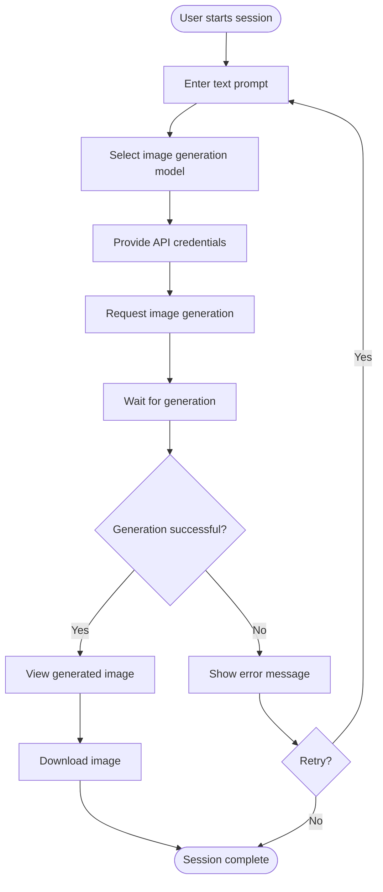
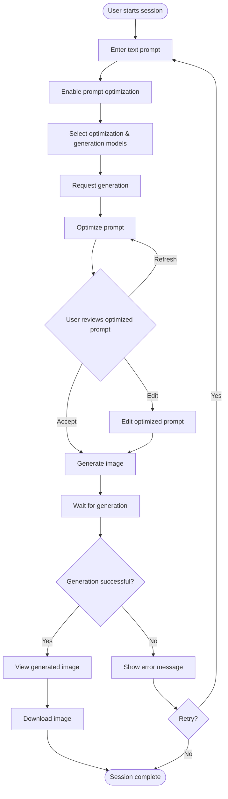
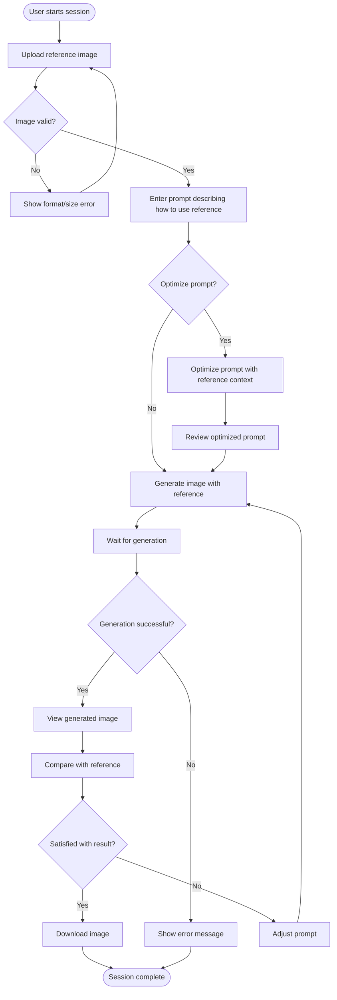
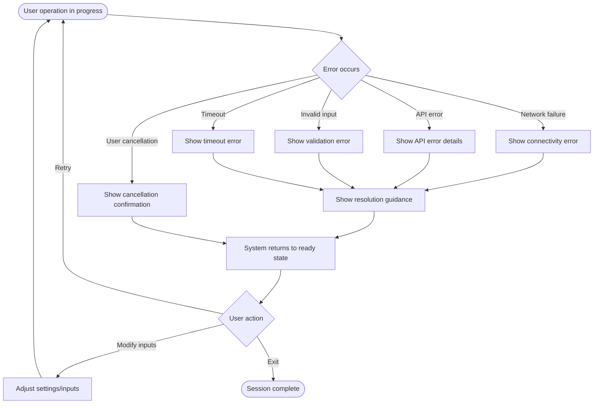

# AI Image Generator - Functional Specification

**Version:** 1.1  
**Date:** February 7, 2026  
**Status:** Implemented (matches v0.1.0)

---

## Table of Contents

1. [Problem Statement & Goals](#1-problem-statement--goals)
2. [User Capabilities](#2-user-capabilities)
3. [Core Concepts & Terminology](#3-core-concepts--terminology)
4. [User Workflows](#4-user-workflows)
5. [Functional Requirements](#5-functional-requirements)
6. [Data Requirements](#6-data-requirements)
7. [Integration Points](#7-integration-points)
8. [Quality Attributes](#8-quality-attributes)
9. [Constraints & Assumptions](#9-constraints--assumptions)
10. [Out of Scope](#10-out-of-scope)

---

## 1. Problem Statement & Goals

### 1.1 Problem Statement

Users want to create AI-generated images from text descriptions but face several challenges:

- **Prompt Engineering Complexity**: Writing effective prompts for image generation requires specialized knowledge and experience. Users often get poor results because their prompts lack the technical detail and structure that AI models need.

- **Model Fragmentation**: Different AI image generation services have different capabilities, pricing, and availability. Users need to access multiple models without learning different APIs or interfaces.

- **Visual Reference Integration**: Users often have reference images that show the style, composition, or subject matter they want, but need a way to incorporate these into the generation process.

- **Long-Running Operations**: Image generation can take significant time (seconds to minutes), and users need visibility into progress and the ability to cancel operations that aren't producing desired results.

- **Technical Barriers**: Using AI image generation services directly requires API knowledge, authentication management, and error handling expertise that many users don't have.

### 1.2 Target Users

- **Creative Professionals**: Designers, artists, and content creators who need to rapidly prototype visual concepts
- **Marketing Teams**: Teams creating visual assets for campaigns who need quick iterations
- **Developers & Researchers**: Technical users experimenting with different AI models and prompt engineering techniques
- **Hobbyists**: Enthusiasts exploring AI image generation for personal projects

### 1.3 Success Criteria

The tool succeeds when:

1. Users with no AI expertise can generate high-quality images from simple descriptions
2. Users can try multiple AI models without learning different APIs
3. Prompt optimization produces measurably better results than unoptimized prompts
4. Users receive clear feedback during long operations and can cancel them when needed
5. The tool handles errors gracefully and provides actionable guidance for resolution

---

## 2. User Capabilities

Users must be able to:

### 2.1 Image Generation

- **As a user**, I can provide a text description of an image I want to create
- **As a user**, I can select from multiple AI image generation models to find the one that best suits my needs
- **As a user**, I can generate images without writing code or calling APIs directly
- **As a user**, I can see the generated image immediately after creation
- **As a user**, I can download generated images in standard formats

### 2.2 Prompt Enhancement

- **As a user**, I can request automatic improvement of my prompt before generation
- **As a user**, I can review and edit the optimized prompt before proceeding
- **As a user**, I can regenerate an optimized prompt if I'm not satisfied with the result
- **As a user**, I can choose to skip optimization and use my original prompt

### 2.3 Reference Images

- **As a user**, I can provide a reference image to guide the generation
- **As a user**, I can upload images in common formats (PNG, JPEG, WebP, HEIC)
- **As a user**, I can describe how the reference image should influence the output via my prompt

### 2.4 Operation Control

- **As a user**, I can cancel a long-running generation or optimization operation
- **As a user**, I can see clear status indicators showing what operation is in progress
- **As a user**, I can receive meaningful error messages when something goes wrong

### 2.5 Configuration

- **As a user**, I can provide my API credentials for external services
- **As a user**, I can select which AI models to use for optimization and generation
- **As a user**, I can configure settings via environment variables or `.env` file
- **As a user**, I can launch the web UI with custom host, port, and sharing options

---

## 3. Core Concepts & Terminology

### 3.1 Prompt

A **prompt** is a text description provided by the user that describes the desired image. Prompts can range from simple phrases ("a red car") to detailed descriptions with technical specifications ("a photorealistic red sports car, shot with 85mm lens, golden hour lighting, shallow depth of field").

**Characteristics:**
- Free-form text input
- No length restrictions (though practical limits exist)
- Can include style directives, technical specifications, and composition instructions
- More detailed prompts generally produce more predictable results

### 3.2 Prompt Optimization

**Prompt optimization** is the process of enhancing a user's original prompt to improve generation results. Optimization adds technical detail, clarifies spatial relationships, specifies viewing angles, and structures the prompt according to best practices.

**Purpose:**
- Bridge the gap between casual descriptions and effective AI prompts
- Add technical specifications (lighting, camera angles, composition)
- Resolve ambiguities in spatial relationships
- Structure information for consistent interpretation

**Characteristics:**
- Optional (user can choose to skip)
- Non-destructive (original prompt preserved)
- User-editable (optimized prompt can be modified before use)
- Cacheable (same inputs produce same optimization)

### 3.3 Reference Image

A **reference image** is an optional visual input provided by the user to guide the generation process. Reference images can convey style, composition, subject matter, or other visual qualities that are difficult to describe in text.

**Use Cases:**
- Style transfer (generate in the style of the reference)
- Subject reference (use the reference subject in a new context)
- Composition guide (match the layout or structure)
- Editing/transformation (modify the reference image according to prompt)

**Characteristics:**
- Optional input
- Must be in a supported image format
- Subject to size constraints for API compatibility
- Described via prompt text (tool doesn't automatically interpret the image)

### 3.4 Image Generation Model

An **image generation model** is an AI service capable of creating images from text and/or image inputs. Different models have different capabilities, styles, speeds, costs, and availability.

**Examples:**
- Text-to-image models (FLUX, Seedream)
- Multimodal models with image generation (Gemini, GPT-5 Image)
- Specialized models (Riverflow)

**Characteristics:**
- Accessed via API
- Different pricing and rate limits
- Different quality and style characteristics
- Different capabilities (some support reference images, others don't)

### 3.5 Generated Image

A **generated image** is the output produced by an image generation model. Generated images are the primary deliverable of the tool.

**Characteristics:**
- Produced in response to a prompt (with optional reference image)
- Available in standard image formats (JPEG, PNG)
- Can be downloaded and used in other applications
- Metadata includes generation time and model used

---

## 4. User Workflows

### 4.1 Basic Generation Workflow

The simplest path from prompt to image:



**Steps:**
1. User enters a text description of desired image
2. User selects an AI model for generation
3. User provides API credentials (if not already configured)
4. User initiates generation
5. System generates image
6. User views and downloads result

**Exit Conditions:**
- Success: Image generated and downloaded
- User cancellation: User cancels during generation
- Error: Generation fails with actionable error message

### 4.2 Optimized Generation Workflow

Enhanced workflow with prompt optimization:



**Steps:**
1. User enters a text description
2. User enables prompt optimization feature
3. User selects optimization model (Ollama) and generation model
4. User initiates generation
5. System optimizes the prompt
6. User reviews, edits, or regenerates optimized prompt
7. System generates image using optimized prompt
8. User views and downloads result

**Key Differences from Basic:**
- Adds optimization step before generation
- Provides review/edit capability for optimized prompt
- Allows regeneration of optimized prompt without starting over
- Caches optimized prompts to avoid redundant optimization

### 4.3 Reference-Based Generation Workflow

Workflow incorporating a reference image:



**Steps:**
1. User uploads a reference image
2. System validates image format and size
3. User enters prompt describing how to use the reference
4. User optionally optimizes prompt (optimization considers reference)
5. System generates image incorporating reference
6. User compares result with reference
7. User iterates or downloads

**Reference Image Considerations:**
- Prompt must describe relationship to reference (style, subject, composition)
- Optimization must preserve reference-related instructions
- Some models may interpret references differently
- File size/format constraints apply

### 4.4 Error Recovery Workflow

Handling failures and cancellations:



**Error Types:**
- **Network errors**: Connection failures, timeouts
- **API errors**: Authentication, rate limits, service unavailable
- **Validation errors**: Invalid inputs, unsupported formats
- **Cancellation**: User-initiated operation abort

**Recovery Principles:**
- System always returns to ready state after errors
- Error messages include actionable guidance
- User can retry without re-entering all inputs
- No data loss (inputs preserved across errors)

---

## 5. Functional Requirements

### 5.1 Prompt Management

#### 5.1.1 Prompt Input
- System shall accept free-form text input for prompts
- System shall support prompts of arbitrary length (within API limits)
- System shall preserve user's original prompt for reference
- System shall validate that prompt is non-empty before generation

#### 5.1.2 Prompt Optimization
- System shall offer optional prompt optimization via AI
- System shall allow user to select optimization model
- System shall preserve original prompt when optimization is enabled
- System shall present optimized prompt for user review
- System shall allow user to edit optimized prompt before generation
- System shall cache optimized prompts to avoid redundant processing
- System shall allow user to regenerate optimized prompt
- System shall handle reference image context in optimization

#### 5.1.3 Prompt Optimization Behavior
- Optimization shall add technical detail (lighting, camera specs, composition)
- Optimization shall clarify spatial relationships and viewing angles
- Optimization shall structure information for consistent interpretation
- Optimization shall preserve reference image instructions verbatim
- Optimization shall not remove or alter user's core intent

### 5.2 Image Generation

#### 5.2.1 Model Selection
- System shall support multiple image generation models
- System shall provide a default model that works reliably
- System shall allow user to select any OpenRouter-compatible model
- System shall provide list of recommended models
- System shall support custom model IDs for flexibility

#### 5.2.2 Generation Execution
- System shall send prompt and optional reference image to selected model
- System shall handle API authentication securely
- System shall track generation time for user feedback
- System shall retrieve generated image in appropriate format
- System shall handle NSFW content detection if provided by API

#### 5.2.3 Generation Parameters
- System shall use prompt (original or optimized) as primary input
- System shall include reference image when provided
- System shall configure API to return image output
- System shall handle model-specific parameter requirements

### 5.3 Reference Images

#### 5.3.1 Image Upload
- System shall support image upload from user's device
- System shall accept PNG, JPEG, WebP, HEIC, and HEIF formats
- System shall validate image format on upload
- System shall provide clear feedback on unsupported formats

#### 5.3.2 Image Processing
- System shall resize images exceeding size limits
- System shall maintain aspect ratio during resizing
- System shall convert images to RGB format as needed
- System shall encode images as JPEG for API transmission (for smaller payload)
- System shall enforce maximum resolution constraint (2 megapixels)
- System shall support data URLs, file paths (str/Path), and raw bytes as input sources

#### 5.3.3 Image Management
- System shall store uploaded images temporarily during session
- System shall clean up temporary files after use
- System shall allow user to clear/replace reference image

### 5.4 Operation Control

#### 5.4.1 Cancellation
- System shall provide cancellation capability for all long-running operations
- System shall cancel prompt optimization when requested
- System shall cancel image generation when requested
- System shall use callback-based cancellation (`cancel_check`) for library operations
- System shall handle SIGINT (Ctrl+C) for CLI cancellation
- System shall use event-based cancellation for UI operations
- System shall terminate background threads/processes on cancellation
- System shall clean up resources after cancellation
- System shall return to ready state after cancellation

#### 5.4.2 Progress Feedback
- System shall indicate when optimization is in progress
- System shall indicate when generation is in progress
- System shall display clear status messages for each operation
- System shall show operation results (success/failure/cancellation)
- System shall report generation time on success

#### 5.4.3 State Management
- System shall track current operation state
- System shall disable conflicting actions during operations
- System shall enable appropriate actions based on state
- System shall handle rapid state transitions correctly

### 5.5 Output Management

#### 5.5.1 Image Display
- System shall display generated image immediately on success
- System shall show image at appropriate size for viewing
- System shall preserve image quality in display

#### 5.5.2 Image Download
- System shall allow user to download generated images
- System shall provide images in standard formats (JPEG or PNG)
- System shall use meaningful filenames for downloads (timestamp-based)
- System shall maintain high quality in downloaded images (95% JPEG quality)

#### 5.5.3 Image Metadata
- System shall track which model generated each image
- System shall record generation time
- System shall associate images with prompts used

### 5.6 Configuration

#### 5.6.1 API Credentials
- System shall require OpenRouter API key for generation
- System shall accept API key via environment variable
- System shall accept API key via user input
- System shall store credentials securely during session
- System shall not log or display credentials in plain text

#### 5.6.2 Model Configuration
- System shall allow selection of image generation model
- System shall allow selection of prompt optimization model
- System shall maintain list of available models via `ui_models.yaml` configuration
- System shall provide reasonable defaults for all models
- System shall allow custom model IDs for flexibility
- System shall support model selection via environment variables (`GENIMG_DEFAULT_MODEL`, `GENIMG_OPTIMIZATION_MODEL`)

#### 5.6.3 Preferences
- System shall remember model selections during session (process-scoped)
- System shall remember optimization preference during session
- System shall preserve prompt cache during session (process-scoped)
- System shall support environment variable configuration for persistence across invocations

---

## 6. Data Requirements

### 6.1 User Inputs

#### 6.1.1 Prompt Data
```
Prompt:
  - text: string (required, non-empty)
  - original_text: string (preserved for reference)
```

#### 6.1.2 Reference Image Data
```
Reference Image:
  - file: binary image data
  - format: PNG | JPEG | WebP | HEIC | HEIF
  - dimensions: width × height (max 2MP)
  - hash: unique identifier for caching
```

#### 6.1.3 Configuration Data
```
Configuration:
  - openrouter_api_key: string (required, sensitive)
  - image_generation_model: string (required)
  - optimization_model: string (optional)
  - optimization_enabled: boolean
```

### 6.2 Processed Data

#### 6.2.1 Optimized Prompt
```
Optimized Prompt:
  - text: string (AI-enhanced prompt)
  - original_prompt: string (reference to source)
  - cache_key: string (for cache lookup)
  - model_used: string (optimization model)
```

#### 6.2.2 Operation State
```
Operation State:
  - current_state: IDLE | OPTIMIZING | GENERATING | CANCELLED | ERROR
  - operation_start_time: timestamp
  - error_message: string (if applicable)
  - can_cancel: boolean
```

### 6.3 Output Data

#### 6.3.1 Generated Image
```
Generated Image (library returns GenerationResult):
  - image: PIL Image (primary output; caller saves, converts format, or gets bytes as needed)
  - _format: str (format from API: 'jpeg' or 'png', accessed via .format property)
  - generation_time: float (seconds)
  - model_used: string
  - prompt_used: string
  - had_reference: boolean
  
  Properties:
  - format: string (read-only property returning _format)
  - image_data: bytes (computed property: image encoded in API format for backward compatibility)
```

**Implementation Notes:**
- The primary output is the PIL Image object (`result.image`)
- Callers can save with custom format/quality: `result.image.save("out.jpg", "JPEG", quality=90)`
- The `image_data` property provides backward-compatible access to raw bytes
- CLI and UI layer determine output filename, not the library

#### 6.3.2 Error Information
```
Error:
  - type: NETWORK | API | VALIDATION | TIMEOUT | CANCELLATION
  - message: string (user-facing)
  - details: string (technical details)
  - recovery_actions: list of strings (guidance)
```

### 6.4 Cache Data

#### 6.4.1 Prompt Optimization Cache
```
Cache Entry:
  - key: hash(prompt, model, reference_hash)
  - value: optimized_prompt_text
  - metadata: implicit (timestamps not stored but cache is process-scoped)
```

**Cache Behavior:**
- In-memory only (process-scoped, not session-scoped)
- Cleared when process exits or via `clear_cache()` API
- Cache lookup via `get_cached_prompt(prompt, model, reference_hash)`
- Direct cache access via `get_cache()` for advanced use cases
- Automatic cache population when `force_refresh=False` (default)
- No size limits (bounded by process lifetime)
- No persistence across process invocations

---

## 7. Integration Points

### 7.1 OpenRouter API

**Purpose:** Primary image generation service

**Capabilities Required:**
- Chat completions endpoint with modalities support
- Image generation via multimodal models
- Support for text prompts and image inputs
- Base64 image encoding for inputs and outputs

**Authentication:**
- Bearer token (API key)
- Provided via Authorization header

**Request Format:**
```
POST {base_url}/chat/completions
Headers:
  - Authorization: Bearer {api_key}
  - Content-Type: application/json
Body:
  - model: string (model ID)
  - modalities: ["image"]
  - messages: array of message objects
    - role: "user"
    - content: array of content parts
      - {type: "text", text: prompt}
      - {type: "image_url", image_url: {url: data_url}} (optional)
```

**Response Format:**
```
Success (JSON):
  - choices[0].message.images[]: array of image objects
    - image_url.url: base64 data URL
  
Success (Direct Image):
  - Content-Type: image/*
  - Body: binary image data

Error:
  - HTTP status code (4xx, 5xx)
  - JSON error object with details
```

**Error Scenarios:**
- 401: Invalid API key
- 404: Model not found or endpoint unavailable
- 429: Rate limit exceeded
- 500: Service error
- Timeout: No response within timeout period
- Network failure: Connection issues

### 7.2 Ollama

**Purpose:** Local prompt optimization service

**Capabilities Required:**
- Text generation via installed models
- Streaming output (not currently used)
- Model management (list, pull)

**Execution:**
- Subprocess execution (`subprocess.Popen`)
- Threading for cancellation support
- No authentication required (local service)

**Invocation Format:**
```
Command: ollama run {model}
Stdin: Optimization prompt (system template + user prompt)
Stdout: Generated optimized prompt
Stderr: Error messages
Exit code: 0 (success) or non-zero (error)
Timeout: Managed via threading and process termination
```

**Optimization Template:**
- Loaded from `src/genimg/prompts.yaml` at runtime
- Contains system instructions for optimization
- Injected with reference image instructions when applicable
- Format: `{template}\n\nOriginal prompt: {user_prompt}\n\nImproved prompt:`

**Output Processing:**
- Strips "Thinking..." blocks from thinking models
- Strips markdown code fences if present
- Returns cleaned prompt text

**Model Management:**
```
Command: ollama list
Stdout: Table of installed models
Format: NAME  ID  SIZE  MODIFIED

Command: ollama pull {model}
Effect: Downloads and installs model
```

**Error Scenarios:**
- Model not found: User needs to install model
- Ollama not installed: User needs to install Ollama
- Timeout: Optimization taking too long (>120s)
- Process killed: Cancellation or system issue

**Assumptions:**
- Ollama installed and available in PATH
- At least one compatible model installed
- Sufficient system resources for model execution

---

## 8. Quality Attributes

### 8.1 Responsiveness

**Requirement:** Users must be able to interrupt long-running operations

**Criteria:**
- Cancellation request acknowledged within 100ms
- Optimization cancelled within 2 seconds of request
- Generation cancelled within 1 second of request (network-dependent)
- UI remains responsive during operations
- Status updates appear within 500ms of state changes

**Failure Modes:**
- Cancellation fails to terminate process: User must force-quit application
- UI freezes during operation: User cannot cancel

### 8.2 Reliability

**Requirement:** System must handle failures gracefully

**Criteria:**
- API failures produce user-friendly error messages
- Network issues detected and reported clearly
- Invalid inputs rejected with specific guidance
- System recovers to ready state after any error
- No data loss on errors (inputs preserved)
- No resource leaks (files, processes cleaned up)

**Error Recovery:**
- Automatic retry not implemented (user must retry manually)
- State reset on error (no partial state)
- Clear indication of error cause
- Actionable guidance for resolution

### 8.3 Usability

**Requirement:** Users with no AI expertise must be able to generate images

**Criteria:**
- Default settings produce working results
- Error messages include resolution steps
- Status indicators clearly show what's happening
- Optimized prompts are readable and editable
- Model selection provides helpful descriptions
- API key configuration has clear instructions

**User Guidance:**
- Tooltips explain each control
- Examples provided for prompts
- Model recommendations for different use cases
- Format requirements stated for uploads

### 8.4 Performance

**Requirement:** Operations complete in reasonable time

**Criteria:**
- Prompt optimization: typically 5-30 seconds (model-dependent)
- Image generation: typically 3-60 seconds (model and complexity-dependent)
- UI operations: instant (<100ms)
- Image upload processing: <2 seconds for typical images
- No unnecessary delays between steps

**Performance Monitoring:**
- Generation time reported to user
- Timeout thresholds prevent indefinite waits
- Long operations can be cancelled

### 8.5 Security

**Requirement:** User credentials and data must be protected

**Criteria:**
- API keys not logged in plain text
- Credentials not displayed in UI (password input type)
- Temporary files cleaned up after use
- No sensitive data in error messages
- Network communication uses HTTPS

**Data Privacy:**
- Prompts and images sent to external services (user aware)
- No local storage of credentials between sessions
- No analytics or telemetry without consent

---

## 9. Constraints & Assumptions

### 9.1 Technical Constraints

#### 9.1.1 Network Connectivity
- **Constraint:** Internet connection required for image generation
- **Impact:** Tool unusable in offline scenarios
- **Rationale:** OpenRouter is cloud-based service

#### 9.1.2 Service Dependencies
- **Constraint:** Depends on OpenRouter API availability
- **Impact:** Service outages prevent image generation
- **Mitigation:** Multiple model options provide some redundancy

#### 9.1.3 Local Service Dependency
- **Constraint:** Prompt optimization requires Ollama installation
- **Impact:** Optimization unavailable without Ollama
- **Mitigation:** Optimization is optional feature

#### 9.1.4 Image Size Limits
- **Constraint:** Reference images limited to 2 megapixels
- **Impact:** Large images automatically resized
- **Rationale:** API payload size and processing limits

#### 9.1.5 Format Support
- **Constraint:** Limited to specific image formats
- **Supported:** PNG, JPEG, WebP, HEIC (with library), HEIF (with library)
- **Impact:** Other formats rejected with error
- **Note:** HEIC/HEIF require additional library installation

### 9.2 Business Constraints

#### 9.2.1 API Costs
- **Constraint:** Each generation incurs API costs
- **Impact:** Users responsible for API charges
- **Consideration:** Different models have different pricing

#### 9.2.2 Rate Limits
- **Constraint:** APIs enforce rate limits
- **Impact:** Rapid repeated generations may be throttled
- **Error Handling:** Rate limit errors reported to user

### 9.3 Assumptions

#### 9.3.1 User Environment
- **Assumption:** User has Python 3.10+ installed
- **Assumption:** User can install Python packages
- **Assumption:** User has sufficient disk space for temporary files
- **Assumption:** User has stable internet connection

#### 9.3.2 User Knowledge
- **Assumption:** User understands basic image generation concepts
- **Assumption:** User can obtain API keys from service providers
- **Assumption:** User can follow installation instructions
- **Assumption:** User understands API usage may incur costs

#### 9.3.3 Service Behavior
- **Assumption:** OpenRouter API follows documented behavior
- **Assumption:** Model capabilities remain relatively stable
- **Assumption:** API response times are reasonable (< 5 minutes)
- **Assumption:** NSFW detection (if available) is reliable

#### 9.3.4 Optimization Behavior
- **Assumption:** Ollama models can improve prompts
- **Assumption:** Optimization doesn't fundamentally change user intent
- **Assumption:** Optimized prompts are generally better than originals
- **Note:** Effectiveness varies by model and use case
