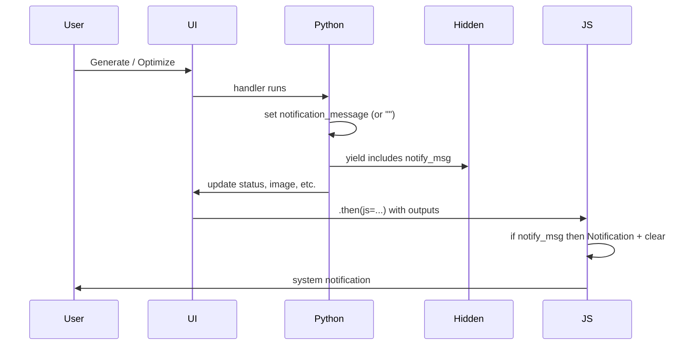

# Browser notifications (Gradio UI)

The Gradio app can show system notifications when long-running tasks (generate or optimize) complete, so users get feedback even if the tab is in the background.

## Architecture

- **Single hidden component**: A `gr.Textbox(visible=False)` holds the notification payload (e.g. `"Image ready"` or `"Generation failed: ..."`). Python sets it only on terminal success/error; in-progress and no-op cases set `""`.
- **JS in `.then()`**: After each of the two flows (generate, optimize), client-side JS reads the last output (the notify payload). If non-empty, it shows `new Notification("genimg", { body: message })`, then returns the same outputs with the payload cleared to `""` so we do not re-notify on a later event.
- **Permission**: Requested on app load via `app.load(js=...)` using `Notification.requestPermission()`.

Notifications are sent for: image generated (success), generation failed (error), optimization complete (success), optimization failed (error). Description is not notified (it is fast). Stop and validation warnings are not notified.
